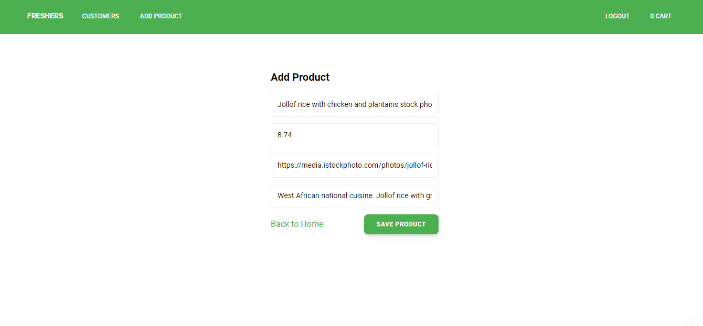
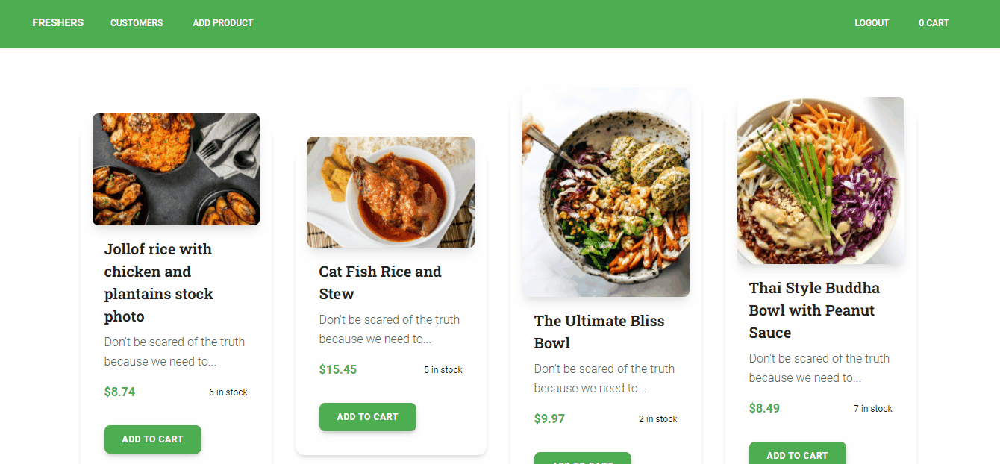
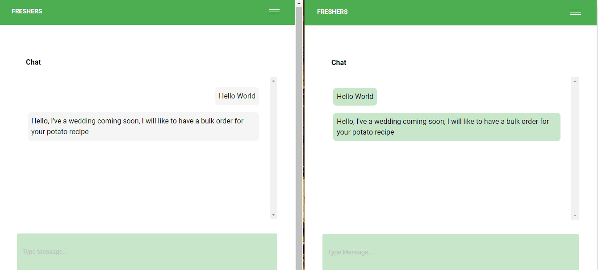

# How To Build A Decentralized Ecommerce Platform with React and Solidtiy

Read the full tutorial here: [**>> How To Build A Decentralized Ecommerce Platform with React and Solidtiy**](https://daltonic.github.io)

This example shows How To Build A Decentralized Ecommerce Platform with React and Solidtiy:


<center><figcaption>Add New Product</figcaption></center>


<center><figcaption>Pay with Ethers</figcaption></center>


<center><figcaption>Chat With Seller</figcaption></center>

## Technology

This demo uses:

- Metamask
- Remix Editor
- Truffle
- Alchamy
- ReactJs
- Tailwind UI Kit
- CometChat
- Solidity
- Web3js
- Faucet

## Running the demo

To run the demo follow these steps:

1. Clone the project with the code below.
    ```sh

    # Make sure you have the above prerequisites installed already!
    git clone https://github.com/Daltonic/freshers.git freshers
    cd frehsers # Navigate to the new folder.
    yarn install # Installs all the dependencies.
    ```
2. Create an Alchemy, Firebase, and CometChat project, copy and paste your key in the spaces below.
2. Update the `.env` file with the following details.
    ```sh
    ENDPOINT_URL=<PROVIDER_URL>
    SECRET_KEY=<SECRET_PHRASE>
    DEPLOYER_KEY=<YOUR_PRIVATE_KEY>

    REACT_APP_COMET_CHAT_REGION=<LOCATION>
    REACT_APP_COMET_CHAT_APP_ID=<APP_ID>
    REACT_APP_COMET_CHAT_AUTH_KEY=<AUTH_KEY>

    REACT_APP_FB_AUTH_KEY=<AUTH_KEY>
    REACT_APP_FB_APP_ID=<APP_ID>
    ```
3. Run the app using `yarn start`
<br/>

If your confuse about the installation, check out this **TUTORIAL** to see how you should run it.

Questions about running the demo? [Open an issue](https://github.com/Daltonic/freshers/issues). We're here to help ✌️

## Useful links

- 🏠 [Website](https://daltonic.github.io/)
- ⚽ [Metamask](https://metamask.io/)
- 🚀 [Remix Editor](https://remix.ethereum.org/)
- 💡 [Truffle](https://trufflesuite.com/)
- 📈 [Alchamy](https://www.alchemy.com/)
- 🔥 [ReactJs](https://reactjs.org/)
- 😊 [Creative Tim](https://www.creative-tim.com/)
- 🐻 [Solidity](https://soliditylang.org/)
- 👀 [Web3Js](https://docs.ethers.io/v5/)
- 🎅 [Faucet](https://faucets.chain.link/rinkeby)
- 🤖 [Ganache](https://trufflesuite.com/ganache/index.html)
- 👀 [CometChat](https://www.cometchat.com/)
- ✨ [Live Demo](https://fresher-a5113.web.app/)